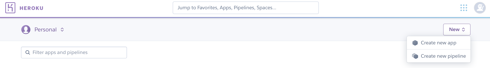

## 手把手製作Telegram Bot (Node.js + Heroku)

### 預備資源及能力
- Telegram 帳號
- Node.js
- git
- 英文閱讀能力

### Telegram新增機器人
1) 先在搜尋欄搜尋:[@BotFather](https://t.me/botfather)
    - 其為Telegram的機器人始祖，所有的機器人都需先向它註冊 
    

2) 訊息欄輸入「/newbot」指令，開始創新的機器人
      

- 接下來輸入想給機器人取的名字(任何語言即可)
      

- 取username，就像這個機器人專屬的ID一樣，**一定要bot做結尾**。<br><br>
BotFather會回傳一組token(黃色遮起來的部份)給你，**這很重要!!**，因為當你要佈署機器人到伺服器後，設定setwebhook時就需要token了!
      

- 當上面步驟完成後，就能在搜尋欄搜尋自己的機器人了，例如我的username是「THU_mou_bot」，如下圖：
      

3) 機器人基本設定
- 回到BotFather的聊天室，輸入「/mybots」指令，列出自己所創的所有機器人。
      

- 點選你剛剛所創的機器人
      

- 點選「Edit Bot」，編輯機器人基本資訊。
    

- 點選任何想更改的資訊，照著BotFather給的回應，很快就能設定好了!
- 修改「Description」，會把其資訊顯示在一開始進入機器人時的畫面。
    

- 修改「About」，會顯示在機器人的個人資訊。
    

- 當你修改好這些設定，會發現，上面的訊息會同步更新。
    

- 修改「Botpic」，上傳機器人的大頭貼，按下按鈕後，請上傳一張圖片。

- 點選「Edit Commands」，即可為機器人增加指令，可讓人家快速查閱此機器人的指令，就像你在BotFather輸入「/newbot」、「/mybots」一樣，都是在這裡設定而成的指令。
    

- 可回到自己的機器人，再訊息欄輸入「/」開頭，就會顯示剛剛設定的指令了
    

### 編寫程式碼
- 太多要解釋了，我很懶XD，直接git clone這一個[範例](https://github.com/hanc1027-articles/TgBot_Nodejs_Example)即可

- 下載回你自己的電腦後，記得把.git的資料夾刪掉哦，不然你push時，會push到我的github上

### Heroku設定
1) [https://dashboard.heroku.com](https://dashboard.heroku.com)，請先自行申請帳號

2) 進入dashboard後，選擇右上角的「New」，新增一個App，點選「Create new app 」。
    

3) 幫heroku app取名，不能有底線、不能有大寫等規則。
    

4) 創建好後，應會在「deploy」的選單頁面，往下看，會看到「Deploy using Heroku Git」區塊，這裡是教你怎麼把寫好的node.js app發佈到Heroku上。<br><br>
第一次佈署跟往後的deploy會不太一樣。
    

    1) 先下載[Heroku CLI](https://devcenter.heroku.com/articles/heroku-command-line)，往後的佈署皆會需要用到。

    2) 照著上面的步驟繼續，先回到node.js的專案，開啟終端機，輸入「heroku login」，這時會跳出網頁頁面，讓你輸入heroku帳密，認證後，就可以做佈署了。

    3) 確認路徑在node.js專案下後，輸入下方的指令：
        ```bash
            $ git init
            $ heroku git:remote -a [你在heroku上取的app名]
        ```

    4) 發佈完成的node.js專案：
        ```bash
            $ git add .
            $ git commit -am "[輸入這次專案修改的內容為哪些]"
            $ git push heroku master
        ```
    
    5) 再來回到你的機器人，輸入任何語句，即會得到回覆，如下：
        

### SetWebhook
- 若輸入訊息，機器人已讀不回，可能有一個原因是webhook跑掉了，需要重置。
- 打開任一個瀏覽器，輸入：
    ```
    https://api.telegram.org/bot{你的機器人token}/setWebhook?url={發佈專案的url}
    ```
- 發佈在heroku上的url，可至 Settings 找到 「Heroku git URL」，是即。
    
- 這一個步驟是把Telegram Bot與Heroku上的專案串聯起來
